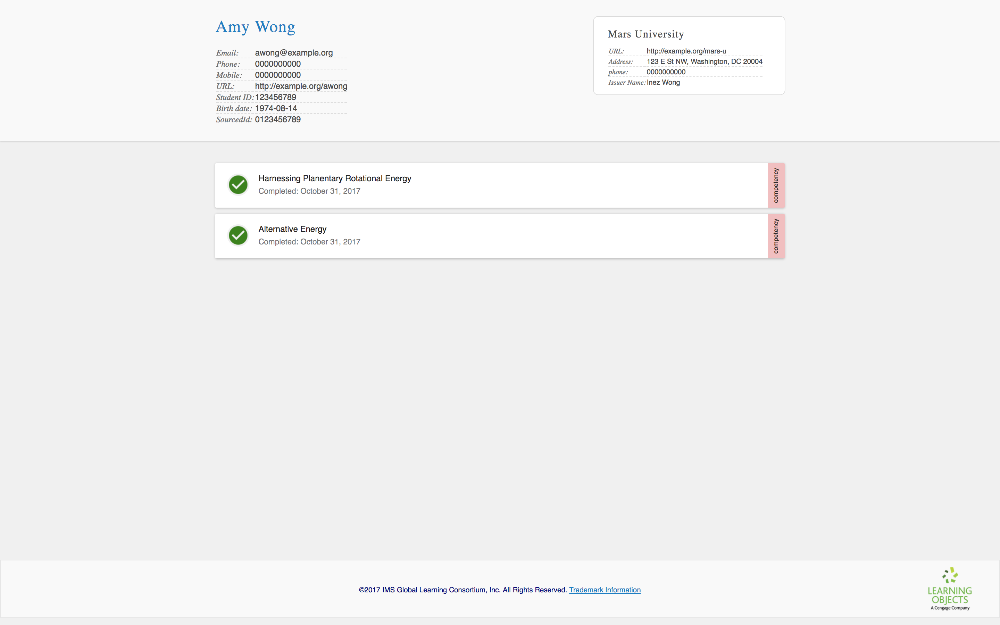

### <a id="add-another-competency"></a> Adding another competency

Say "Harnessing Planetary Rotational Energy" is part of a higher level competency, "Alternative Energy".

To express this in the transcript, we're going to need to:
1. Add the new transcript entity for the second competency
2. Add the record for the learner
3. Associate the two competencies

First, let's add the transcript entity:

```
{
  ...
  "transcriptEntities": {
    "id": "urn:uuid:98f56753-973d-4c2d-865a-f567c9896ed7",
    "type": "TranscriptEntitySet",
    "competencies": [
      {
        "id": "urn:uuid:D2986DEB-AF8D-42B9-9E29-E64784B9E12C",
        "type": "Competency",
        "name": "Harnessing Planetary Rotational Energy"
      },{
        "id": "urn:uuid:b2c3235a-49a5-4222-aba9-80c960cb832e",
        "type": "Competency",
        "name": "Alternative Energy"
      }
    ]
  }
}

```

As expected, if you save the file and upload it to the viewer, you will see that nothing has changed.

Second, let's add another record:

```
{
  ...
  "records": [
    {
      "id": "urn:uuid:327de957-910c-4b8d-bdb4-2efc79ebc0e9",
      "type": "Record",
      "date": "2017-11-01T00:00:00.000Z",
      "result": "Mastered",
      "recordOf": {
        "id": "urn:uuid:ec7fdc47-5787-4992-b49c-d47f400dcee2",
        "type": "TranscriptEntityLink",
        "entityType": "Competency",
        "entityId": "urn:uuid:D2986DEB-AF8D-42B9-9E29-E64784B9E12C"
      }
    },{
      "id": "urn:uuid:ac10a029-05e7-4364-8521-97c3a4018388",
      "type": "Record",
      "date": "2017-11-01T00:00:00.000Z",
      "result": "Mastered",
      "recordOf": {
        "id": "urn:uuid:c8d04637-c503-455a-b1d8-826f1e23eb7f",
        "type": "TranscriptEntityLink",
        "entityType": "Competency",
        "entityId": "urn:uuid:b2c3235a-49a5-4222-aba9-80c960cb832e"
      }
    }
  ],
  ...
}
```

We have one more step, but before we proceed, save your changes and upload the transcript to the IMS Extended Transcript Viewer. You should see two unrelated competency records.

<table class="image">
<caption align="bottom">Our transcript should now have two unrelated competency records.</caption>
<tr><td></td></tr>
</table>
