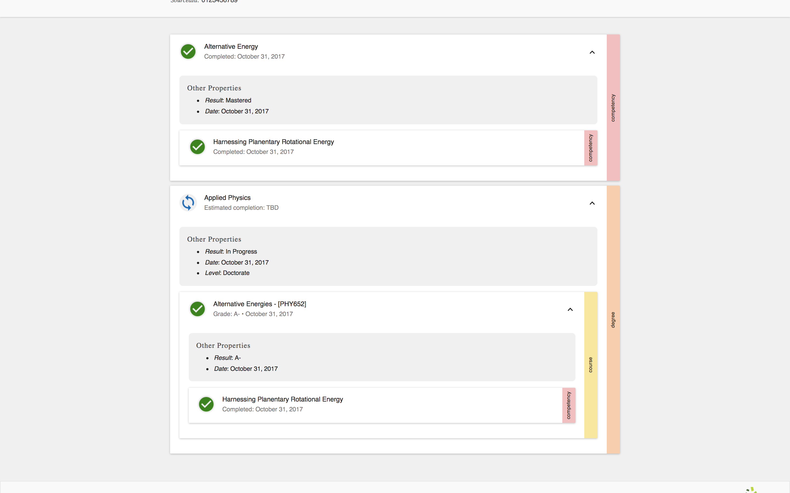

### <a id="multiple-parents"></a> Specifying multiple parents

The final enhancement we want to make will demonstrate the flexibility of associations.

Let's say that the "Harnessing Planetary Rotational Energy" competency is taught in PHY652. Since it is already the child of the "Alternative Energy" competency, this competency will have two parents.

Let's update the definition of the course to achieve this:

```
{
  ...
  "transcriptEntities": {
    "competencies": [
     ...
    ],
    "courses": [
      {
        "id": "urn:uuid:f5c50dc2-c256-4da7-8ddd-14b76f3c19e1",
        "type": "Course",
        "name": "Alternative Energies",
        "courseCode": "PHY652"
      },
      "associations": [
        {
         "id": "urn:uuid:ca8193b0-0ee5-487c-a8f8-ea4b839aab58",
         "type": "Association",
         "entityType": "Competency",
         "entityId": "urn:uuid:D2986DEB-AF8D-42B9-9E29-E64784B9E12C",
         "associationType": "isParentOf"
        }
      ]
    ],
    "degrees": [
      ...
    ]
  }
}
```

If you load your transcript in the viewer, you should see this:

<table class="image">
<caption align="bottom">"Harnessing Planetary Rotational Energy" now has two parents.</caption>
<tr><td></td></tr>
</table>

> *Technical aside*: the transcript entities are a collection of directed (potentially cyclical) graphs, and are not guaranteed to form trees.
