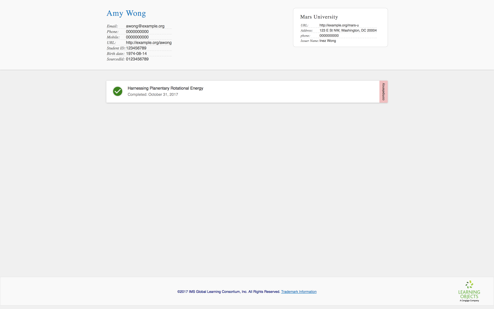
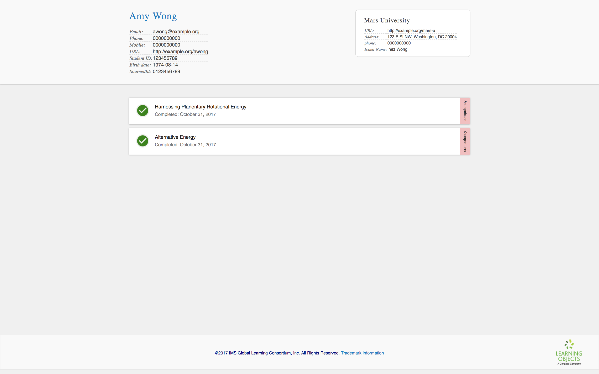
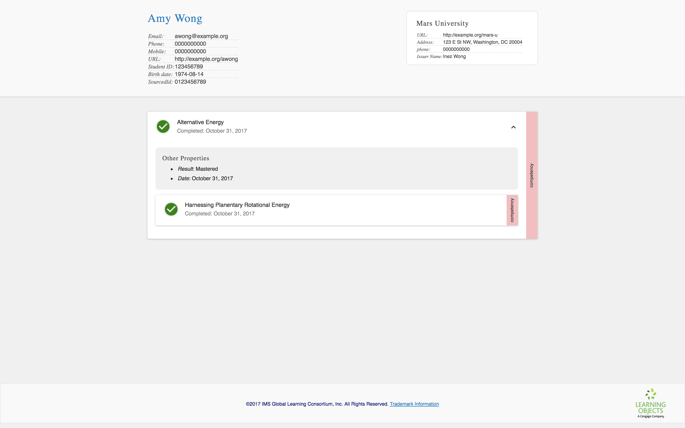
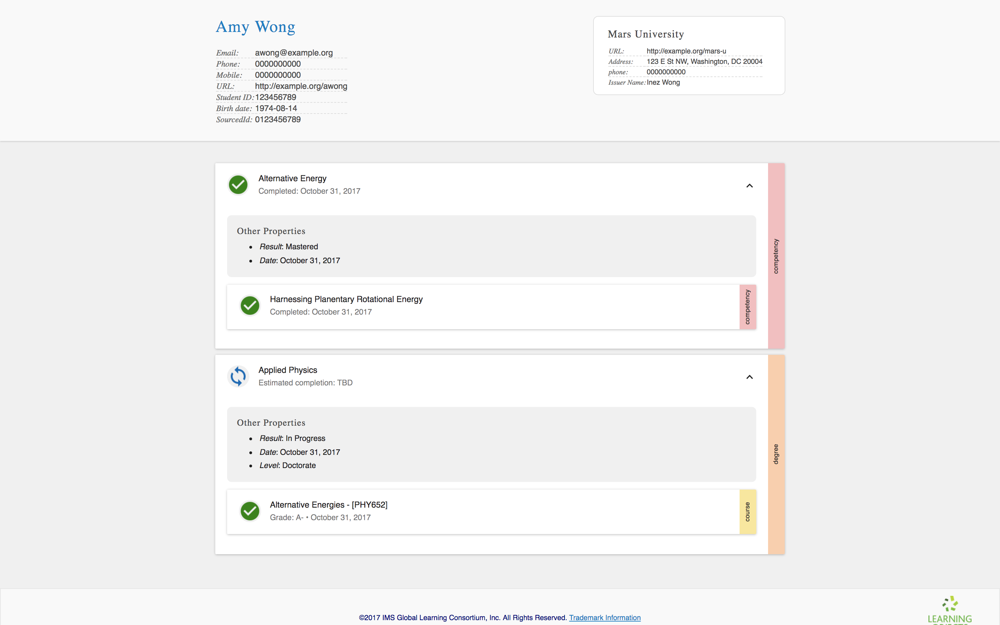
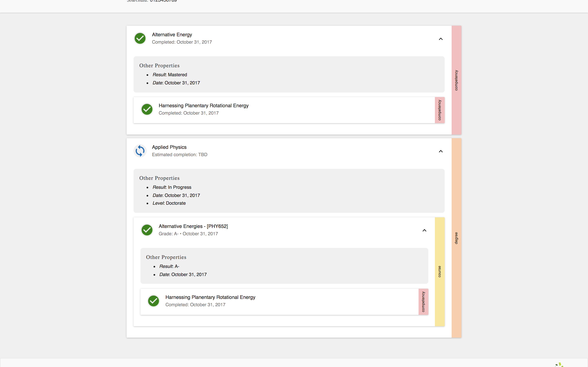

# Let's build an extended transcript!

Bryan Smith, [Learning Objects](http://learningobjects.com)

## <a id="overview"></a> Overview

If you attended a postsecondary institution, you probably know what a transcript is: a document (usually physical) with a list of courses, associated credits and grades, along with a cumulative GPA and cumulative credit hours.

While a transcript is useful for verifying a learner's educational background, it doesn't say much about the learner's journey. What material was covered in a given course? What assessments were used? What was the course's relationship to a program or degree? What skills did a learner demonstrate, and in what areas is the learner strong or still growing?

### <a id="what-is-et"></a> What's an extended transcript?

The [IMS Extended Transcript](http://www.imsglobal.org/activity/extended-transcript) standard defines a data model and service for institutions to provide supplemental information to traditional transcripts, offering institutions the ability to recognize achievements beyond course and degree completion.

An extended transcript can include information about courses and degree programs, as well as assessments, certificates, and extracurriculars. Additionally, it provides a catch-all achievement type, and the data model is extensible.

Additionally, the standard supports competency-based education (CBE). The data model includes competencies, each of which may have complex relationships with other competencies. A transcript can represent anything from a flat list of skills to a complex ontology of competencies with alignments to other competency standards, and the institution can express a range of proficiency levels and outcomes.

The Extended Transcript standard supports interoperability with other IMS standards, such as Learner Information Systems (LIS) and the new Competencies & Academic Standards Exchange (CASE). An extended transcript can contain references to hosted badge assertions from the Open Badges standard. (Furthermore, the transcript itself can appear within a badge assertion in order to make the entire transcript verifiable.)

Due to its rich data model and interoperability with other standards, the Extended Transcript standard opens up many interesting integration possibilities. Transcript clients can fetch transcripts in order to show learners, employers, and advisors different views of learner progress and achievements. It can also be used by the learner to share a collection badges with a badge displayer, or it can be used by employers and educational partners to match learners with professional opportunities. One day, it could even be used by institutions to automatically recognize prior educational achievements.

### <a id="in-this-tutorial"></a> In this tutorial

We're going to learn about the transcript data model by building a transcript from scratch.

While you do so, I encourage you to review your transcript by uploading it to the [IMS Extended Transcript Viewer](http://projects.imsglobal.org/eT-viewer/). Before we get started, take a few minutes to look at the existing sample transcripts.

<table class="image">
<caption align="bottom">The IMS Extended Transcript Viewer. You can either upload a transcript or view one of the available samples.</caption>
<tr><td></td></tr>
</table>

<table class="image">
<caption align="bottom">This is one of the predefined transcript samples. Madison is enrolled in a fictional institution, CBU, and has been enrolled in two computer science degree programs.</caption>
<tr><td></td></tr>
</table>

Note that the Extended Transcript standard does not prescribe what a transcript looks like, or how a transcript viewer should behave. <a href="http://learningobjects.com/#/">Learning Objects</a> created this viewer for the IMS community to encourage adoption (and since then, other member institutions have contributed to the project), but other transcript viewers may look very different, perhaps omitting some types of data or displaying relationships differently.

<table class="image">
<caption align="bottom">Same transcript as above, but displayed in the Learning Objects transcript viewer. In this screenshot, the viewer is configured to only display competencies.</caption>
<tr><td></td></tr>
</table>

<table class="image">
<caption align="bottom">Same sample and viewer, but this time the viewer is configured to display courses. While the Extended Transcript standard provides a data model, it does not prescribe how a transcript should appear or what it must contain beyond basic required information.</caption>
<tr><td></td></tr>
</table>

## <a id="first-transcript"></a> Your first transcript!

To get started, all you need is a text editor.

If you use a Mac, you can use TextEdit (under "Format" menu, select "Make Plain Text"), and if you use MS Windows, you can use Notepad. I'm using [Atom Editor](https://atom.io/), and there are plenty of other cross-platform, open source options out there.

Knowledge of [JSON](https://www.json.org/) will be helpful, but you should able to follow along regardless. If you get stuck, take a look at the [complete transcript](#complete-transcript) in the appendix.

I've added technical asides for experienced developers, but they are not essential to the tutorial, so do not be concerned if they do not make sense to you.

(*Hint*: while JSON is very forgiving about spaces, the standard is unforgiving about the presence and absence of commas. Look at examples carefully, and check for missing or superfluous commas.)

### <a id="jsonld"></a> About JSON-LD

Before we start, you may have heard that the Extended Transcript standard uses [JSON-LD](https://json-ld.org/). (It does!)

You may also have heard things about JSON-LD that make it sound technically or conceptually difficult, but no need to worry: except where indicated in this tutorial, you don't need to do anything special to support it.

> *Technical aside*: JSON-LD is JSON. If you follow the instructions below, working with the Extended Transcript data model will be similar to working with any other JSON format.

This is great news, because if you or your stakeholders care about linked data in the future, you'll be able to leverage its JSON-LD capabilities!

### <a id="minimal-example"></a> Minimal example

Open your text editor, and create a new file: `my-first-transcript.json`

Add the following to the file and save it:

```json
{
  "@context": "https://purl.imsglobal.org/ctx/extended-transcript/v1p0",
  "id": "urn:uuid:f95fe190-9f8d-4576-85c3-7bdfb892ce5c",
  "type": "ExtendedTranscript",
  "createdAt": "2017-12-04T00:00:00.00Z",
  "issuer": {
    "id": "urn:uuid:618374e0-e761-4ccb-813a-db66e1d08310",
    "type": "Issuer",
    "name": "Mars University",
    "url": "http://example.org/mars-u"
  },
  "person": {
    "id": "urn:uuid:de15d276-a85d-4341-ba3b-d1fb86fed22c",
    "type": "Person",
    "fullName": "Amy Wong",
    "givenName": "Amy",
    "familyName": "Wong"
  },
  "records": [],
  "transcriptEntities": {
    "id": "urn:uuid:9a065540-5fc8-4fed-9dc1-a28ad51e8ee8",
    "type": "TranscriptEntitySet"
  }
}
```

> *Technical aside*: the `records` property is actually not required, while everything else included above is. However, as you will see, `records` will appear in practically every transcript, and including it here will make the following snippets easier to follow.

Go ahead an upload it to the [IMS Extended Transcript Viewer](http://projects.imsglobal.org/eT-viewer/). You should see this:

<table class="image">
<caption align="bottom">Our minimal extended transcript.</caption>
<tr><td></td></tr>
</table>

Let's break this down. Here's what the transcript is telling us:
* This transcript was created on Dec 12, 2017
* It was issued by Mars University
* The learner is Amy Wong

What about the other data?

```
"@context": "https://purl.imsglobal.org/ctx/extended-transcript/v1p0",
```

This tells us that this document should conform to Extended Transcript version 1.0 standard.

```
"id": "urn:uuid:f95fe190-9f8d-4576-85c3-7bdfb892ce5c",
```

This assigns an identifier to the transcript. While you may not need this value, the system consuming your transcript might. Regardless, you must include it.

Pay attention as we build out this transcript; almost everything will contain an `id`, and we will frequently use these values to establish associations between different entities in the transcript. Note that the value in `id` must be unique for every "thing".

You may wonder: why is the ID so long? We're using [data URLs](https://developer.mozilla.org/en-US/docs/Web/HTTP/Basics_of_HTTP/Data_URIs). Without getting into the weeds, it is better to use data URLs for JSON-LD interoperability, but feel free to use simpler identifiers (e.g., `"1"`, `"2"`, etc) to get started. (The IMS Extended Transcript viewer will still understand your transcripts with simpler identifiers.)

```
"type": "ExtendedTranscript",
```

This declares that the object is a transcript. Like `id`, you will see that almost everything has a `type` declaration.

> *Technical aside*: the entire data model is monomorphic, in the sense that the type of data appearing anywhere in the document is always predictable without referencing a `type` value. However, we include the `type` property because it is required by JSON-LD. It also enables better error messaging and makes the JSON document more humanly readable.

Go ahead and try adding some more fields to your user and issuer:

```
{
  ...
  "issuer": {
      "id": "urn:uuid:618374e0-e761-4ccb-813a-db66e1d08310",
      "type": "Issuer",
      "name": "Mars University",
      "url": "http://example.org/mars-u",
      "address": "123 E St NW, Washington, DC 20004",
      "phone": "0000000000",
      "issuingPersonFullName": "Inez Wong"
  },
  "person": {
      "id": "urn:uuid:de15d276-a85d-4341-ba3b-d1fb86fed22c",
      "type": "Person",
      "fullName": "Amy Wong",
      "givenName": "Amy",
      "familyName": "Wong",
      "email": "awong@example.org",
      "phone": "0000000000",
      "mobile": "0000000000",
      "url": "http://example.org/awong",
      "studentId": "123456789",
      "birthDate": "1974-08-14",
      "sourcedId": "0123456789"
  },
  ...
}
```

(*Note*: do not include the "..." above. I'll use ellipsis to skip over long, repetitive content throughout the tutorial. Just replace the content between the ellipsis.)

As a bonus, try adding a `logo` to issuer. (*Hint*: look at the examples in the IMS Extended Transcript Viewer; after you select a transcript, you can access its source via the "Source" link.)

### <a id="add-competency"></a> Adding a competency

Let's add a competency to our transcript:

```
{
  ...
  "transcriptEntities": {
    "id": "urn:uuid:98f56753-973d-4c2d-865a-f567c9896ed7",
    "type": "TranscriptEntitySet",
    "competencies": [
      {
        "id": "urn:uuid:D2986DEB-AF8D-42B9-9E29-E64784B9E12C",
        "type": "Competency",
        "name": "Harnessing Planetary Rotational Energy"
      }
    ]
  }
}
```

After saving your changes, go ahead and upload it to the viewer. What do you see?

Interesting, nothing changed. Where's the competency?

In the Extended Transcript Standard, there's a distinction between transcript entities and records. What we just accomplished is describing that there is a competency, "Harnessing Planetary Rotational Energy"; however, we didn't declare anything about whether the learner achieved mastery of this competency.

Let's change that:

```
{
  ...
  "records": [
    {
      "id": "urn:uuid:327de957-910c-4b8d-bdb4-2efc79ebc0e9",
      "type": "Record",
      "date": "2017-11-01T00:00:00.000Z",
      "result": "Mastered",
      "recordOf": {
        "id": "urn:uuid:ec7fdc47-5787-4992-b49c-d47f400dcee2",
        "type": "TranscriptEntityLink",
        "entityType": "Competency",
        "entityId": "urn:uuid:D2986DEB-AF8D-42B9-9E29-E64784B9E12C"
      }
    }
  ],
  "transcriptEntities": {
    "id": "urn:uuid:98f56753-973d-4c2d-865a-f567c9896ed7",
    "type": "TranscriptEntitySet",
    "competencies": [
      {
        "id": "urn:uuid:D2986DEB-AF8D-42B9-9E29-E64784B9E12C",
        "type": "Competency",
        "name": "Harnessing Planetary Rotational Energy"
      }
    ]
  }
}
```

A few things to note:
* The value of `date` indicates that the record was last updated on Nov 1, 2017.
* The value of `result` is `"Mastered"`; we're declaring that Amy mastered the referenced competency.
* Both the `TranscriptEntityLink`'s `entityId` and the `Competency`'s `id` have the same value, `"urn:uuid:D2986DEB-AF8D-42B9-9E29-E64784B9E12C"`. This is how a record references a transcript entity.

> Technical aside: `result` has an open vocabulary; there are no restrictions on what values you can set to result, as long as it is a string.

What about the `Record`'s `id`? Just like the `id` belonging to the entire transcript, it's required, though you may never use it.

So here's what we have so far:

```json
{
  "@context": "https://purl.imsglobal.org/ctx/extended-transcript/v1p0",
  "id": "urn:uuid:f95fe190-9f8d-4576-85c3-7bdfb892ce5c",
  "type": "ExtendedTranscript",
  "createdAt": "2017-04-25T00:00:00.00Z",
  "issuer": {
    "id": "urn:uuid:618374e0-e761-4ccb-813a-db66e1d08310",
    "type": "Issuer",
    "name": "Mars University",
    "url": "http://example.org/mars-u",
    "address": "123 E St NW, Washington, DC 20004",
    "phone": "0000000000",
    "issuingPersonFullName": "Inez Wong"
  },
  "person": {
    "id": "urn:uuid:de15d276-a85d-4341-ba3b-d1fb86fed22c",
    "type": "Person",
    "fullName": "Amy Wong",
    "givenName": "Amy",
    "familyName": "Wong",
    "email": "awong@example.org",
    "phone": "0000000000",
    "mobile": "0000000000",
    "url": "http://example.org/awong",
    "studentId": "123456789",
    "birthDate": "1974-08-14",
    "sourcedId": "0123456789"
  },
  "records": [
    {
      "id": "urn:uuid:327de957-910c-4b8d-bdb4-2efc79ebc0e9",
      "type": "Record",
      "date": "2017-11-01T00:00:00.000Z",
      "result": "Mastered",
      "recordOf": {
        "id": "urn:uuid:ec7fdc47-5787-4992-b49c-d47f400dcee2",
        "type": "TranscriptEntityLink",
        "entityType": "Competency",
        "entityId": "urn:uuid:D2986DEB-AF8D-42B9-9E29-E64784B9E12C"
      }
    }
  ],
 "transcriptEntities": {
    "id": "urn:uuid:98f56753-973d-4c2d-865a-f567c9896ed7",
    "type": "TranscriptEntitySet",
    "competencies": [
      {
        "id": "urn:uuid:D2986DEB-AF8D-42B9-9E29-E64784B9E12C",
        "type": "Competency",
        "name": "Harnessing Planetary Rotational Energy"
      }
    ]
  }
}
```

You should see something this:

<table class="image">
<caption align="bottom">Our transcript should now have one competency record in it.</caption>
<tr><td></td></tr>
</table>

What if Amy is still working on this competency? Try this:

```
{
  ...
  "records": [
    {
     "id": "urn:uuid:327de957-910c-4b8d-bdb4-2efc79ebc0e9",
     "type": "Record",
     "date": "2017-11-01T00:00:00.000Z",
     "result": "In Progress",
     "recordOf": {
        "id": "urn:uuid:ec7fdc47-5787-4992-b49c-d47f400dcee2",
        "type": "TranscriptEntityLink",
        "entityType": "Competency",
        "entityId": "urn:uuid:D2986DEB-AF8D-42B9-9E29-E64784B9E12C"
     },
     "status": {
        "id": "urn:uuid:D4ACF5F3-3627-4739-911F-A61D252D1EC0",
        "type": "RecordStatus",
        "completed": false
     }
    }
  ],
  ...
}
```

### <a id="add-another-competency"></a> Adding another competency

Say "Harnessing Planetary Rotational Energy" is part of a higher level competency, "Alternative Energy".

To express this in the transcript, we're going to need to:
1. Add the new transcript entity for the second competency
2. Add the record for the learner
3. Associate the two competencies

First, let's add the transcript entity:

```
{
  ...
  "transcriptEntities": {
    "id": "urn:uuid:98f56753-973d-4c2d-865a-f567c9896ed7",
    "type": "TranscriptEntitySet",
    "competencies": [
      {
        "id": "urn:uuid:D2986DEB-AF8D-42B9-9E29-E64784B9E12C",
        "type": "Competency",
        "name": "Harnessing Planetary Rotational Energy"
      },{
        "id": "urn:uuid:b2c3235a-49a5-4222-aba9-80c960cb832e",
        "type": "Competency",
        "name": "Alternative Energy"
      }
    ]
  }
}

```

As expected, if you save the file and upload it to the viewer, you will see that nothing has changed.

Second, let's add another record:

```
{
  ...
  "records": [
    {
      "id": "urn:uuid:327de957-910c-4b8d-bdb4-2efc79ebc0e9",
      "type": "Record",
      "date": "2017-11-01T00:00:00.000Z",
      "result": "Mastered",
      "recordOf": {
        "id": "urn:uuid:ec7fdc47-5787-4992-b49c-d47f400dcee2",
        "type": "TranscriptEntityLink",
        "entityType": "Competency",
        "entityId": "urn:uuid:D2986DEB-AF8D-42B9-9E29-E64784B9E12C"
      }
    },{
      "id": "urn:uuid:ac10a029-05e7-4364-8521-97c3a4018388",
      "type": "Record",
      "date": "2017-11-01T00:00:00.000Z",
      "result": "Mastered",
      "recordOf": {
        "id": "urn:uuid:c8d04637-c503-455a-b1d8-826f1e23eb7f",
        "type": "TranscriptEntityLink",
        "entityType": "Competency",
        "entityId": "urn:uuid:b2c3235a-49a5-4222-aba9-80c960cb832e"
      }
    }
  ],
  ...
}
```

We have one more step, but before we proceed, save your changes and upload the transcript to the IMS Extended Transcript Viewer. You should see two unrelated competency records.

<table class="image">
<caption align="bottom">Our transcript should now have two unrelated competency records.</caption>
<tr><td></td></tr>
</table>

### <a id="associating-competencies"></a> Associating the competencies

Third, let's declare that "Alternative Energy" is the parent of "Harnessing Planetary Rotational Energy":

```
{
  ...
  "transcriptEntities": {
    "id": "urn:uuid:98f56753-973d-4c2d-865a-f567c9896ed7",
    "type": "TranscriptEntitySet",
    "competencies": [
      {
        "id": "urn:uuid:D2986DEB-AF8D-42B9-9E29-E64784B9E12C",
        "type": "Competency",
        "name": "Harnessing Planetary Rotational Energy"
      },{
        "id": "urn:uuid:b2c3235a-49a5-4222-aba9-80c960cb832e",
        "type": "Competency",
        "name": "Alternative Energy",
        "associations": [
          {
            "id": "urn:uuid:7aade551-fbc8-44b5-8b96-036632858117",
            "type": "Association",
            "entityType": "Competency",
            "entityId": "urn:uuid:D2986DEB-AF8D-42B9-9E29-E64784B9E12C",
            "associationType": "isParentOf"
          }
        ]
      }
    ]
  }
}
```

Note that the `Association`'s `entityId` matches the `id` for the "Harnessing Planetary Rotational Energy" competency. Similar to how records reference entities, this is how we relate entities to other entities.

> *Technical aside*: order of transcript entities is not important; you may make forward or backward references.

Save the changes and upload it to the viewer.

<table class="image">
<caption align="bottom">The competencies are now associated via a parent-child association.</caption>
<tr><td></td></tr>
</table>

Alternatively, we could have declared that "Harnessing Planetary Rotational Energy" is the child of "Alternative Energy" using the `"isChildOf"` type. Can you figure out how?

There are a total of ten available association types, though you will probably mostly use `"isParentOf"` or `"isChildOf"`. The standard is very flexible: any transcript entity may have any association with any association type with any other transcript entities. But of course, the provider is responsible for generating transcripts where these associations make sense to the people using the transcripts and the systems interpreting them.

> *Technical aside*: For more discussion on what is sensible, see the section on [Cycles and Paradoxes](https://www.imsglobal.org/sites/default/files/ExtendedTranscript/etv1p0candidatefinal/ET-Bestpractices/etservicev1p0_bestpracticesv1p0.html#cycles-and-paradoxes) in the Extended Transcript Recommended Practices guide.

To learn more about available associations, see the [AssocationType Vocabulary Description](https://www.imsglobal.org/sites/default/files/ExtendedTranscript/etv1p0candidatefinal/ET-InformationModel/ETServiceGroup_InfoModel.html#Enumerated_AssociationType) section within the Extended Transcript Information Model documentation.

### <a id="add-degree-course"></a> Adding a degree program and a course

Let's wrap up this tutorial by adding a couple of new transcript entity types.

Amy is working on her PhD in Applied Physics, and she took a course in alternative energies.

Let's define the transcript entities first:

```
{
  ...
  "transcriptEntities": {
    "competencies": [
      ...
    ],
    "courses": [
      {
        "id": "urn:uuid:f5c50dc2-c256-4da7-8ddd-14b76f3c19e1",
        "type": "Course",
        "name": "Alternative Energies",
        "courseCode": "PHY652"
      }
    ],
    "degrees": [
      {
        "id": "urn:uuid:ec7273f2-db4a-4f97-8763-8385e52154a1",
        "type": "Degree",
        "name": "Applied Physics",
        "level": "Doctorate",
        "associations": [
          {
            "id": "urn:uuid:e4ca862f-a322-4f9e-9222-6d8ce17582c5",
            "type": "Association",
            "entityType": "Course",
            "entityId": "urn:uuid:f5c50dc2-c256-4da7-8ddd-14b76f3c19e1",
            "associationType": "isParentOf"
          }
        ]
      }
    ]
  }
}
```

Take note that the degree is the parent of the course, declared using an `"isParentOf"` association.

Next, let's add records for both of the new entities:

```
{
  ...
  "records": [
    {
      ...
    },{
      ...
    },{
      "id": "urn:uuid:304abbae-6c2c-41af-b425-c5d7ce26bcdc",
      "type": "Record",
      "date": "2017-11-01T00:00:00.000Z",
      "result": "In Progress",
      "recordOf": {
        "id": "urn:uuid:227263e6-0798-43bc-bb45-efa21311d964",
        "type": "TranscriptEntityLink",
        "entityType": "Degree",
        "entityId": "urn:uuid:ec7273f2-db4a-4f97-8763-8385e52154a1"
      },
      "status": {
        "id": "urn:uuid:1ec6e8e0-7772-4721-aacd-5120b8da6478",
        "type": "RecordStatus",
        "completed": false
      }
    },{
     "id": "urn:uuid:630e3899-ed94-4c2d-be74-2f6d24f31774",
     "type": "Record",
     "date": "2017-11-01T00:00:00.000Z",
     "result": "A-",
     "recordOf": {
        "id": "urn:uuid:9b058f5b-c807-478b-aa6c-394c7d3c1f57",
        "type": "TranscriptEntityLink",
        "entityType": "Course",
        "entityId": "urn:uuid:f5c50dc2-c256-4da7-8ddd-14b76f3c19e1"
      }
    }
  ],
  ...
}
```

Again, we see that the `TranscriptEntityLink`'s `entityId` matches the relevant entity's `id`.

If you load your transcript in the viewer, you should see this:

<table class="image">
<caption align="bottom">The transcript now includes two competencies, a course, and a degree program.</caption>
<tr><td></td></tr>
</table>

### <a id="multiple-parents"></a> Specifying multiple parents

The final enhancement we want to make will demonstrate the flexibility of associations.

Let's say that the "Harnessing Planetary Rotational Energy" competency is taught in PHY652. Since it is already the child of the "Alternative Energy" competency, this competency will have two parents.

Let's update the definition of the course to achieve this:

```
{
  ...
  "transcriptEntities": {
    "competencies": [
     ...
    ],
    "courses": [
      {
        "id": "urn:uuid:f5c50dc2-c256-4da7-8ddd-14b76f3c19e1",
        "type": "Course",
        "name": "Alternative Energies",
        "courseCode": "PHY652"
      },
      "associations": [
        {
         "id": "urn:uuid:ca8193b0-0ee5-487c-a8f8-ea4b839aab58",
         "type": "Association",
         "entityType": "Competency",
         "entityId": "urn:uuid:D2986DEB-AF8D-42B9-9E29-E64784B9E12C",
         "associationType": "isParentOf"
        }
      ]
    ],
    "degrees": [
      ...
    ]
  }
}
```

If you load your transcript in the viewer, you should see this:

<table class="image">
<caption align="bottom">"Harnessing Planetary Rotational Energy" now has two parents.</caption>
<tr><td></td></tr>
</table>

> *Technical aside*: the transcript entities are a collection of directed (potentially cyclical) graphs, and are not guaranteed to form trees.

## <a id="closing-thoughts"></a> Closing thoughts

I hope this tutorial has provided a useful introduction to the Extended Transcript data model. At first blush, it may seem complicated (yes, our example is around 140 lines!), but it is conceptually quite simple.

In summary, in order to create an extended transcript, you must specify:
* the issuer (the educational institution) and person (the learner)
* transcript entities to describe the potential educational activities
* records to describe the learner's experience and/or results with the transcript entities

As we saw earlier in the tutorial, there need not be a record for every entity, and it is also possible to create records for incomplete experiences.

We didn't cover many details, including extensibility, verification, Open Badge capabilities, and alignment with other standards. For a deeper dive, take a look at the [IMS Extended Transcript](http://www.imsglobal.org/activity/extended-transcript) page, the sample transcripts in the IMS Transcript Viewer, and the Recommended Practices and Implementation Guide.

## <a id="author"></a> About the author

Bryan Smith is a Software Engineering Manager at [Learning Objects](http://learningobjects.com), and an active member of the IMS Extended Transcript workgroup.

## <a id="appendix"></a> Appendix

### <a id="complete-transcript"></a> Completed transcript

```json
{
  "@context":"https://purl.imsglobal.org/ctx/extended-transcript/v1p0",
  "id":"urn:uuid:f95fe190-9f8d-4576-85c3-7bdfb892ce5c",
  "type":"ExtendedTranscript",
  "createdAt":"2017-04-25T00:00:00.00Z",
  "issuer":{
    "id":"urn:uuid:618374e0-e761-4ccb-813a-db66e1d08310",
    "type":"Issuer",
    "name":"Mars University",
    "url":"http://example.org/mars-u",
    "address":"123 E St NW, Washington, DC 20004",
    "phone":"0000000000",
    "issuingPersonFullName":"Inez Wong"
  },
  "person":{
    "id":"urn:uuid:de15d276-a85d-4341-ba3b-d1fb86fed22c",
    "type":"Person",
    "fullName":"Amy Wong",
    "givenName":"Amy",
    "familyName":"Wong",
    "email":"awong@example.org",
    "phone":"0000000000",
    "mobile":"0000000000",
    "url":"http://example.org/awong",
    "studentId":"123456789",
    "birthDate":"1974-08-14",
    "sourcedId":"0123456789"
  },
  "records":[
    {
      "id":"urn:uuid:327de957-910c-4b8d-bdb4-2efc79ebc0e9",
      "type":"Record",
      "date":"2017-11-01T00:00:00.000Z",
      "result":"Mastered",
      "recordOf":{
        "id":"urn:uuid:ec7fdc47-5787-4992-b49c-d47f400dcee2",
        "type":"TranscriptEntityLink",
        "entityType":"Competency",
        "entityId":"urn:uuid:D2986DEB-AF8D-42B9-9E29-E64784B9E12C"
      }
    },
    {
      "id":"urn:uuid:ac10a029-05e7-4364-8521-97c3a4018388",
      "type":"Record",
      "date":"2017-11-01T00:00:00.000Z",
      "result":"Mastered",
      "recordOf":{
        "id":"urn:uuid:c8d04637-c503-455a-b1d8-826f1e23eb7f",
        "type":"TranscriptEntityLink",
        "entityType":"Competency",
        "entityId":"urn:uuid:b2c3235a-49a5-4222-aba9-80c960cb832e"
      }
    },
    {
      "id":"urn:uuid:304abbae-6c2c-41af-b425-c5d7ce26bcdc",
      "type":"Record",
      "date":"2017-11-01T00:00:00.000Z",
      "result":"In Progress",
      "recordOf":{
        "id":"urn:uuid:227263e6-0798-43bc-bb45-efa21311d964",
        "type":"TranscriptEntityLink",
        "entityType":"Degree",
        "entityId":"urn:uuid:ec7273f2-db4a-4f97-8763-8385e52154a1"
      },
      "status":{
        "id":"urn:uuid:1ec6e8e0-7772-4721-aacd-5120b8da6478",
        "type":"RecordStatus",
        "completed":false
      }
    },
    {
      "id":"urn:uuid:630e3899-ed94-4c2d-be74-2f6d24f31774",
      "type":"Record",
      "date":"2017-11-01T00:00:00.000Z",
      "result":"A-",
      "recordOf":{
        "id":"urn:uuid:9b058f5b-c807-478b-aa6c-394c7d3c1f57",
        "type":"TranscriptEntityLink",
        "entityType":"Course",
        "entityId":"urn:uuid:f5c50dc2-c256-4da7-8ddd-14b76f3c19e1"
      }
    }
  ],
  "transcriptEntities":{
    "id":"urn:uuid:98f56753-973d-4c2d-865a-f567c9896ed7",
    "type":"TranscriptEntitySet",
    "competencies":[
      {
        "id":"urn:uuid:D2986DEB-AF8D-42B9-9E29-E64784B9E12C",
        "type":"Competency",
        "name":"Harnessing Planetary Rotational Energy"
      },
      {
        "id":"urn:uuid:b2c3235a-49a5-4222-aba9-80c960cb832e",
        "type":"Competency",
        "name":"Alternative Energy",
        "associations":[
          {
            "id":"urn:uuid:7aade551-fbc8-44b5-8b96-036632858117",
            "type":"Association",
            "entityType":"Competency",
            "entityId":"urn:uuid:D2986DEB-AF8D-42B9-9E29-E64784B9E12C",
            "associationType":"isParentOf"
          }
        ]
      }
    ],
    "courses":[
      {
        "id":"urn:uuid:f5c50dc2-c256-4da7-8ddd-14b76f3c19e1",
        "type":"Course",
        "name":"Alternative Energies",
        "courseCode":"PHY652",
        "associations":[
          {
            "id":"urn:uuid:ca8193b0-0ee5-487c-a8f8-ea4b839aab58",
            "type":"Association",
            "entityType":"Competency",
            "entityId":"urn:uuid:D2986DEB-AF8D-42B9-9E29-E64784B9E12C",
            "associationType":"isParentOf"
          }
        ]
      }
    ],
    "degrees":[
      {
        "id":"urn:uuid:ec7273f2-db4a-4f97-8763-8385e52154a1",
        "type":"Degree",
        "name":"Applied Physics",
        "level":"Doctorate",
        "associations":[
          {
            "id":"urn:uuid:e4ca862f-a322-4f9e-9222-6d8ce17582c5",
            "type":"Association",
            "entityType":"Course",
            "entityId":"urn:uuid:f5c50dc2-c256-4da7-8ddd-14b76f3c19e1",
            "associationType":"isParentOf"
          }
        ]
      }
    ]
  }
}
```
