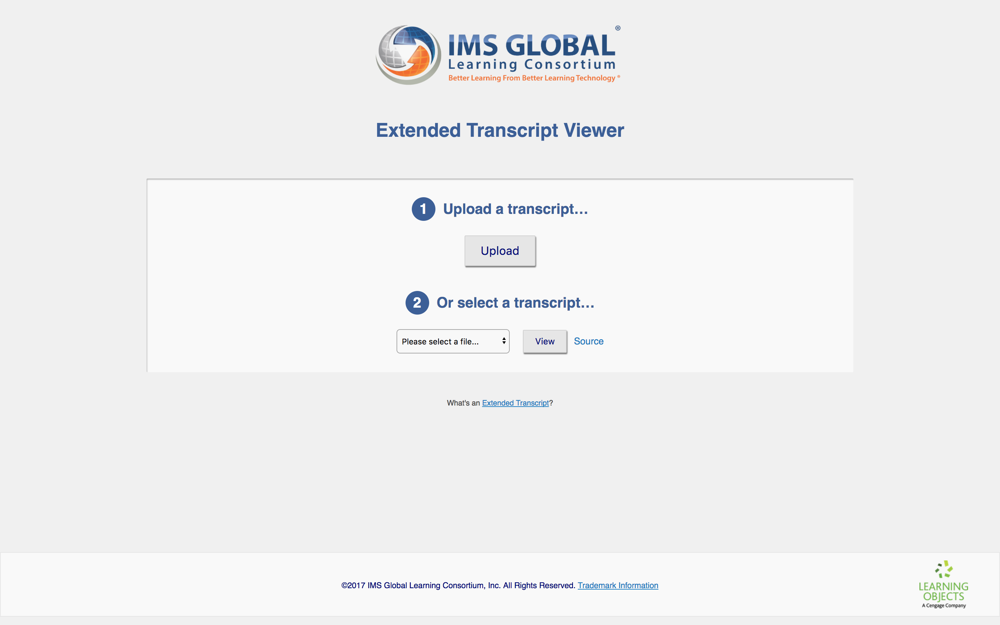
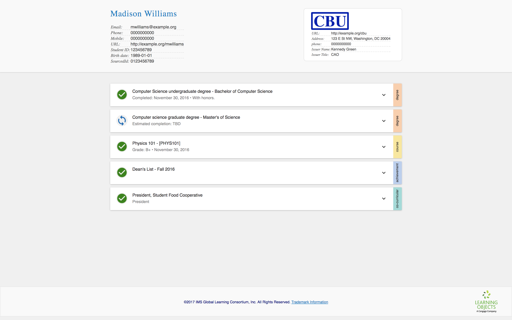
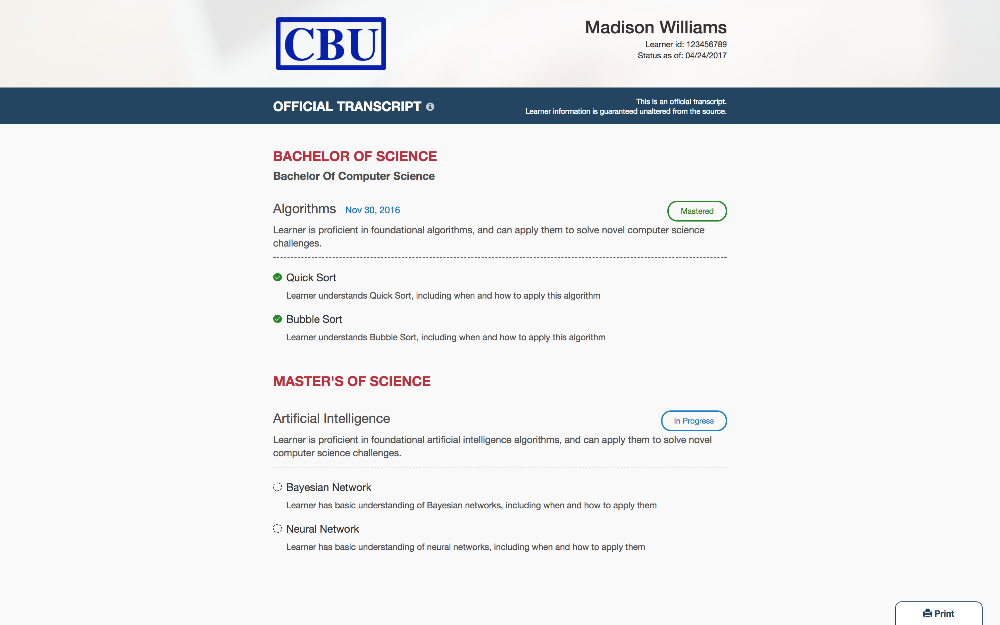
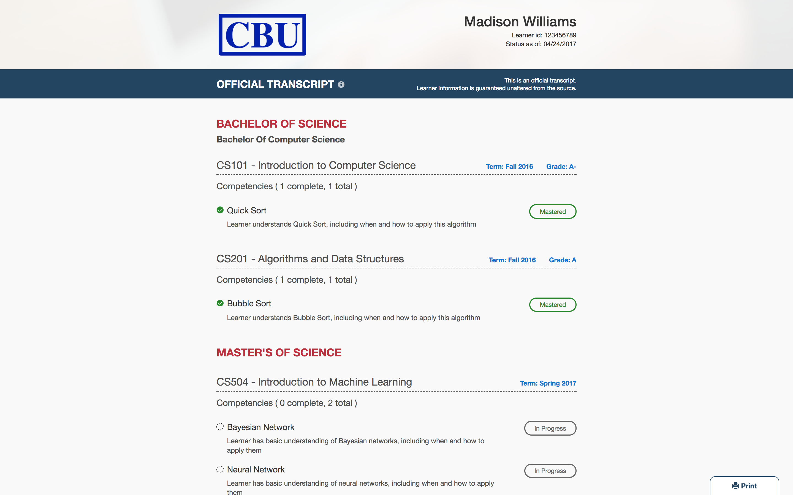
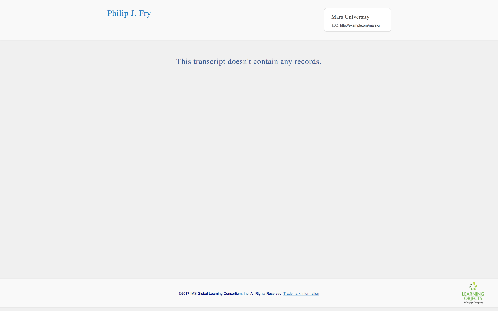

# Getting started with the IMS Extended Transcript standard
## Part 1: Let's build an extended transcript!

**TODO: add TOC**

## <a name=""></a> Overview

If you attended a postsecondary institution, you probably know what a transcript is: a document (often physical) with a list of courses and their associated credits and grades issued by the registrar at an educational institution. This document is usually available upon request by the learner and sent directly to third parties (other educational institutions or employers) in order to provide a verified summary of a learner's educational experience.

So, what's an extended transcript, and how is it different from a traditional transcript?

### <a name=""></a> What's an extended transcript?

While a transcript is useful for verifying a learner's educational background, it doesn't say much about the learner's journey. What material was covered in a given course? What assessments were used? What was the course's relationship to a program or degree? What skills did a learner demonstrate, and in what areas is the learner strong or still growing?

The Extended Transcript standard defines a data model and service for institutions to provide details about learner achievements. It provides additional granularity to traditional transcripts, offering institutions the ability to recognize achievements beyond course and degree completion.

The standard supports (but doesn't presume) competency-based education (CBE). The Extended Transcript standard supports competencies, each of which may have complex relationships with other competencies. A transcript can represent anything from a flat list of skills to a complex ontology of competencies with alignments to other competency standards, and the institution can express a range of proficiency levels and outcomes.

Beyond the competency model, an extended transcript can include information about courses and degree programs, as well as assessments, certificates, and extracurriculars. Additionally, it provides a catch-all achievement type, and the data model is extensible. All of these types may have explicit relationships, and may even reference evidence.

The Extended Transcript standard supports interoperability with other IMS standards, such as Learning Information Systems (LIS) and the new Competencies & Academic Standards Exchange (CASE). An extended transcript can contain references to hosted badge assertions from the Open Badges standard. (Futhermore, the transcript itself can appear within a badge assertion in order to make the transcript itself verifiable!)

Due to its rich data model and interoperability with other standards, the Extended Transcript standard has a lot of potential in terms of integrating systems. Transcript clients can fetch transcripts in order to show learners, employers, and advisors different views of learner progress and achievements. It can also be used by the learner to share a collection badges with a badge displayer, or it can be used by employers and educational partners to match learners with professional opportunities. One day, it could even be used by institutions to automatically recognize prior educational achievements.

## <a name=""></a> In the tutorial

We're going to learn about the transcript data model by creating a progressively-complex transcript from scratch!

While you do so, I encourage you to review your transcript by uploading it to the [IMS Extended Transcript Viewer](http://projects.imsglobal.org/eT-viewer/). Before we get started, take a few minutes to look at the existing sample transcripts.

<table class="image">
<caption align="bottom">The [IMS Extended Transcript Viewer](http://projects.imsglobal.org/eT-viewer/). You can either upload an transcript or view one of the samples.</caption>
<tr><td></td></tr>
</table>

<table class="image">
<caption align="bottom">This is one of the predefined transcript samples. Madison is enrolled in a fictional institution, CBU, and has attended two computer science programs.</caption>
<tr><td></td></tr>
</table>

Note that the Extended Transcript standard does not prescribe what a transcript looks like, or how a transcript viewer should behave. Learning Objects created this viewer for the IMS community (and since then, other members have contributed!) in order to encourage adoption and demonstrate how the standard works, but other transcript viewers may look very different, perhaps omitting some types of data or displaying relationships differently.

<table class="image">
<caption align="bottom">Same transcript as above, but displayed in the <a href="http://learningobjects.com/#/">Learning Objects</a> transcript viewer. In this screenshot, the viewer is configured to only display  competencies.</caption>
<tr><td></td></tr>
</table>

<table class="image">
<caption align="bottom">Same sample and viewer, but this time the viewer is configured to display courses. While the Extended Transcript standard provides a data model, it does not prescribe how a transcript should appear or what it must contain.</caption>
<tr><td></td></tr>
</table>

## <a name=""></a> Your first transcript!

All you need it a text editor. If you use a Mac, you can use TextEdit (under "Format" menu, select "Make Plain Text"), and if you use MS Windows, you can use Notepad. I'm using [Atom Editor](https://atom.io/), and there are plenty of other open source options out there.

While knowledge of [JSON](https://www.json.org/) is a plus, no previous programming or web development experience is required.

### <a name=""></a> About JSON-LD

Before we start, you might have heard that the Extended Transcript standard uses [JSON-LD](https://json-ld.org/). (It does!) You might have heard things about JSON-LD that make it sound technically or conceptually difficult, but no need to worry: except as indicated in this tutorial, you don't need to do anything special outside to support it. As long as you follow the outlined instructions, you can create and read extended transcripts without knowing anything about JSON-LD.

Which is great, because if future you (or one of your consumers) does care about linked data, you'll be able to leverage its JSON-LD capabilities. And meanwhile, IMS already has plans that will leverage JSON-LD. (E.g., to enable verifiable transcripts using badge extensions.)

### <a name=""></a> Minimal example

Open your text edit, and create a new file: `my-first-transcript.json`

Add the following to the file and save it:

```json
{
  "@context": "https://purl.imsglobal.org/ctx/extended-transcript/v1p0",
  "id": "urn:uuid:f95fe190-9f8d-4576-85c3-7bdfb892ce5c",
  "type": "ExtendedTranscript",
  "createdAt": "2017-12-04T00:00:00.00Z",
  "issuer": {
    "id": "urn:uuid:618374e0-e761-4ccb-813a-db66e1d08310",
    "type": "Issuer",
    "name": "Mars University",
    "url": "http://example.org/mars-u"
  },
  "person": {
    "id": "urn:uuid:de15d276-a85d-4341-ba3b-d1fb86fed22c",
    "type": "Person",
    "fullName": "Philip J. Fry",
    "givenName": "Philip",
    "familyName": "Fry"
  },
  "transcriptEntities": {
    "id": "urn:uuid:9a065540-5fc8-4fed-9dc1-a28ad51e8ee8",
    "type": "TranscriptEntitySet"
  }
}
```

Go ahead an upload it to the [IMS Extended Transcript Viewer](http://projects.imsglobal.org/eT-viewer/)

<table class="image">
<caption align="bottom">Our minimal extended transcript.</caption>
<tr><td></td></tr>
</table>

Let's break this down. Here's what the transcript is telling us:
* This transcript was created on Dec 12, 2017
* It was issued by Mars University
* The learner is Philip J. Fry

What about the data?

```
{
  "@context": "https://purl.imsglobal.org/ctx/extended-transcript/v1p0",
  ...
}
```

Tells us that this document should conform to Extended Transcript version 1.0 standard.

```
{
  ...
  "id": "urn:uuid:f95fe190-9f8d-4576-85c3-7bdfb892ce5c",
  ...
}
```

Gives the transcript an identifier. While you may not need this value, a consumer might. Regardless, you need to include it.

Note that as we evolve our example, almost everything in the transcript will also contain an `id`, and we will frequently used these values to establish relationships.

You may wonder: why is the ID so long? We're using [data URLs](https://developer.mozilla.org/en-US/docs/Web/HTTP/Basics_of_HTTP/Data_URIs). Without getting into the weeds, it is better to use data URLs for JSON-LD interoperability, but you can get by with numeric identifiers (`1`, `2`, etc) for purposes of this tutorial.

```
{
  ...
  "type": "ExtendedTranscript",
  ...
}
```

Declares that the object is a transcript.

(*Technical aside*: the entire data model is monomorphic, in the sense that the type of data appearing anywhere in the document is always predictable without referencing a `type` value. However, we include the `type` property because it is required by JSON-LD, but it also makes the JSON document more human readable. It also helps with error detection.)

Go ahead and try adding some more fields to your user and issuer:

```
{
  ...
  "issuer": {
    "id": "urn:uuid:618374e0-e761-4ccb-813a-db66e1d08310",
    "type": "Issuer",
    "name": "Mars University",
    "url": "http://example.org/mars-u",
    "address": "123 E St NW, Washington, DC 20004",
    "phone": "0000000000",
    "issuingPersonFullName": "Inez Wong"
  },
  "person": {
    "id": "urn:uuid:de15d276-a85d-4341-ba3b-d1fb86fed22c",
    "type": "Person",
    "fullName": "Philip J. Fry",
    "givenName": "Philip",
    "familyName": "Fry",
    "email": "pfry@example.org",
    "phone": "0000000000",
    "mobile": "0000000000",
    "url": "http://example.org/pfry",
    "studentId": "123456789",
    "birthDate": "1974-08-14",
    "sourcedId": "0123456789"
  },
  ...
}
```

As a bonus, try adding a `logo` to issuer. (Hint: you'll need a URL to a web-accessible logo.)

### <a name=""></a> Adding a competency

### <a name=""></a> Adding another competency

### <a name=""></a> Adding a program and a course
