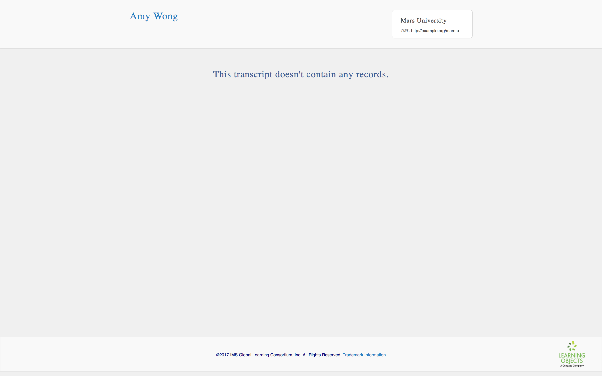

### <a id="minimal-example"></a> Minimal example

Open your text editor, and create a new file: `my-first-transcript.json`

Add the following to the file and save it:

```json
{
  "@context": "https://purl.imsglobal.org/ctx/extended-transcript/v1p0",
  "id": "urn:uuid:f95fe190-9f8d-4576-85c3-7bdfb892ce5c",
  "type": "ExtendedTranscript",
  "createdAt": "2017-12-04T00:00:00.00Z",
  "issuer": {
    "id": "urn:uuid:618374e0-e761-4ccb-813a-db66e1d08310",
    "type": "Issuer",
    "name": "Mars University",
    "url": "http://example.org/mars-u"
  },
  "person": {
    "id": "urn:uuid:de15d276-a85d-4341-ba3b-d1fb86fed22c",
    "type": "Person",
    "fullName": "Amy Wong",
    "givenName": "Amy",
    "familyName": "Wong"
  },
  "records": [],
  "transcriptEntities": {
    "id": "urn:uuid:9a065540-5fc8-4fed-9dc1-a28ad51e8ee8",
    "type": "TranscriptEntitySet"
  }
}
```

> *Technical aside*: the `records` property is actually not required, while everything else included above is. However, as you will see, `records` will appear in practically every transcript, and including it here will make the following snippets easier to follow.

Go ahead an upload it to the [IMS Extended Transcript Viewer](http://projects.imsglobal.org/eT-viewer/). You should see this:

<table class="image">
<caption align="bottom">Our minimal extended transcript.</caption>
<tr><td></td></tr>
</table>

Let's break this down. Here's what the transcript is telling us:
* This transcript was created on Dec 12, 2017
* It was issued by Mars University
* The learner is Amy Wong

What about the other data?

```
"@context": "https://purl.imsglobal.org/ctx/extended-transcript/v1p0",
```

This tells us that this document should conform to Extended Transcript version 1.0 standard.

```
"id": "urn:uuid:f95fe190-9f8d-4576-85c3-7bdfb892ce5c",
```

This assigns an identifier to the transcript. While you may not need this value, the system consuming your transcript might. Regardless, you must include it.

Pay attention as we build out this transcript; almost everything will contain an `id`, and we will frequently use these values to establish associations between different entities in the transcript. Note that the value in `id` must be unique for every "thing".

You may wonder: why is the ID so long? We're using [data URLs](https://developer.mozilla.org/en-US/docs/Web/HTTP/Basics_of_HTTP/Data_URIs). Without getting into the weeds, it is better to use data URLs for JSON-LD interoperability, but feel free to use simpler identifiers (e.g., `"1"`, `"2"`, etc) to get started. (The IMS Extended Transcript viewer will still understand your transcripts with simpler identifiers.)

```
"type": "ExtendedTranscript",
```

This declares that the object is a transcript. Like `id`, you will see that almost everything has a `type` declaration.

> *Technical aside*: the entire data model is monomorphic, in the sense that the type of data appearing anywhere in the document is always predictable without referencing a `type` value. However, we include the `type` property because it is required by JSON-LD. It also enables better error messaging and makes the JSON document more humanly readable.

Go ahead and try adding some more fields to your user and issuer:

```
{
  ...
  "issuer": {
      "id": "urn:uuid:618374e0-e761-4ccb-813a-db66e1d08310",
      "type": "Issuer",
      "name": "Mars University",
      "url": "http://example.org/mars-u",
      "address": "123 E St NW, Washington, DC 20004",
      "phone": "0000000000",
      "issuingPersonFullName": "Inez Wong"
  },
  "person": {
      "id": "urn:uuid:de15d276-a85d-4341-ba3b-d1fb86fed22c",
      "type": "Person",
      "fullName": "Amy Wong",
      "givenName": "Amy",
      "familyName": "Wong",
      "email": "awong@example.org",
      "phone": "0000000000",
      "mobile": "0000000000",
      "url": "http://example.org/awong",
      "studentId": "123456789",
      "birthDate": "1974-08-14",
      "sourcedId": "0123456789"
  },
  ...
}
```

(*Note*: do not include the "..." above. I'll use ellipsis to skip over long, repetitive content throughout the tutorial. Just replace the content between the ellipsis.)

As a bonus, try adding a `logo` to issuer. (*Hint*: look at the examples in the IMS Extended Transcript Viewer; after you select a transcript, you can access its source via the "Source" link.)
