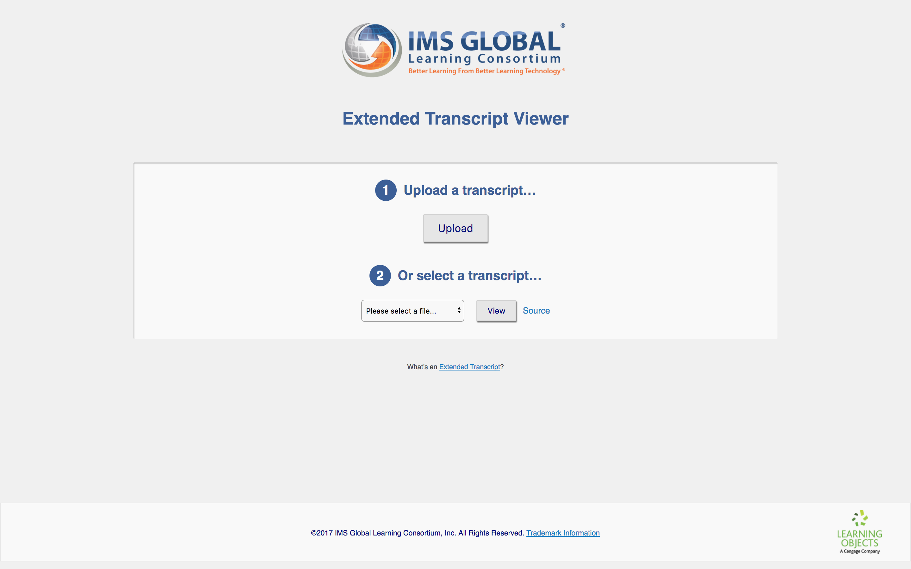
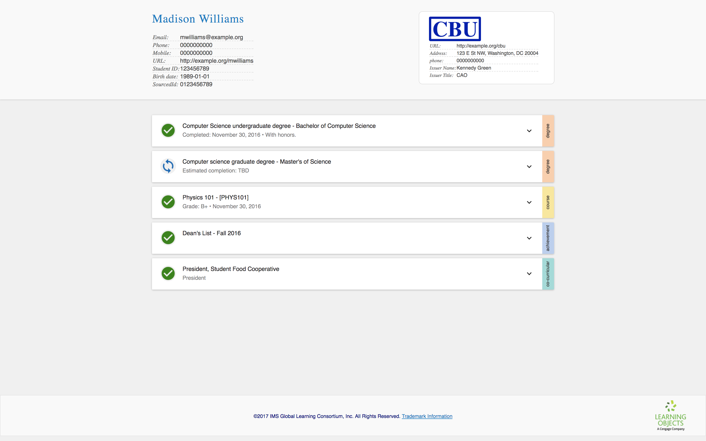
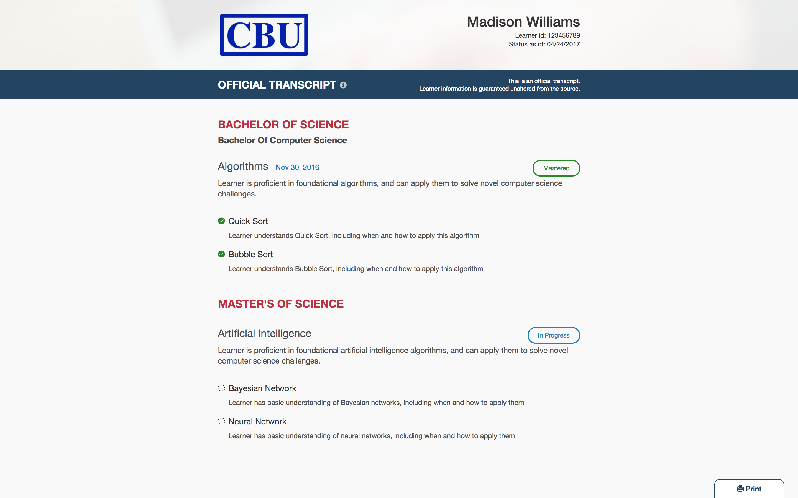
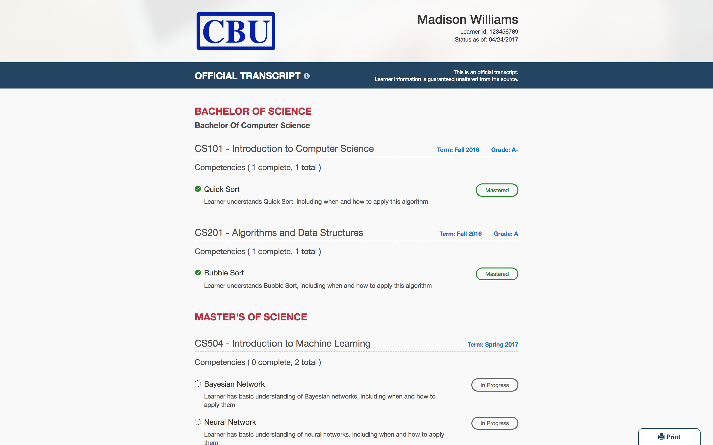

###  In this tutorial

We're going to learn about the transcript data model by building a transcript from scratch.

While you do so, I encourage you to review your transcript by uploading it to the [IMS Extended Transcript Viewer](http://projects.imsglobal.org/eT-viewer/). Before we get started, take a few minutes to look at the existing sample transcripts.

<table class="image">
<caption align="bottom">The IMS Extended Transcript Viewer. You can either upload a transcript or view one of the available samples.</caption>
<tr><td></td></tr>
</table>

<table class="image">
<caption align="bottom">This is one of the predefined transcript samples. Madison is enrolled in a fictional institution, CBU, and has been enrolled in two computer science degree programs.</caption>
<tr><td></td></tr>
</table>

Note that the Extended Transcript standard does not prescribe what a transcript looks like, or how a transcript viewer should behave. <a href="http://learningobjects.com/#/">Learning Objects</a> created this viewer for the IMS community to encourage adoption (and since then, other member institutions have contributed to the project), but other transcript viewers may look very different, perhaps omitting some types of data or displaying relationships differently.

<table class="image">
<caption align="bottom">Same transcript as above, but displayed in the Learning Objects transcript viewer. In this screenshot, the viewer is configured to only display competencies.</caption>
<tr><td></td></tr>
</table>

<table class="image">
<caption align="bottom">Same sample and viewer, but this time the viewer is configured to display courses. While the Extended Transcript standard provides a data model, it does not prescribe how a transcript should appear or what it must contain beyond basic required information.</caption>
<tr><td></td></tr>
</table>
