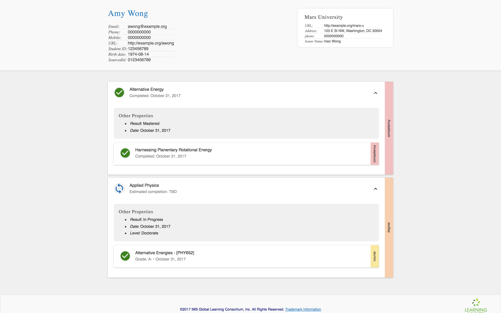

### <a id="add-degree-course"></a> Adding a degree program and a course

Let's wrap up this tutorial by adding a couple of new transcript entity types.

Amy is working on her PhD in Applied Physics, and she took a course in alternative energies.

Let's define the transcript entities first:

```
{
  ...
  "transcriptEntities": {
    "competencies": [
      ...
    ],
    "courses": [
      {
        "id": "urn:uuid:f5c50dc2-c256-4da7-8ddd-14b76f3c19e1",
        "type": "Course",
        "name": "Alternative Energies",
        "courseCode": "PHY652"
      }
    ],
    "degrees": [
      {
        "id": "urn:uuid:ec7273f2-db4a-4f97-8763-8385e52154a1",
        "type": "Degree",
        "name": "Applied Physics",
        "level": "Doctorate",
        "associations": [
          {
            "id": "urn:uuid:e4ca862f-a322-4f9e-9222-6d8ce17582c5",
            "type": "Association",
            "entityType": "Course",
            "entityId": "urn:uuid:f5c50dc2-c256-4da7-8ddd-14b76f3c19e1",
            "associationType": "isParentOf"
          }
        ]
      }
    ]
  }
}
```

Take note that the degree is the parent of the course, declared using an `"isParentOf"` association.

Next, let's add records for both of the new entities:

```
{
  ...
  "records": [
    {
      ...
    },{
      ...
    },{
      "id": "urn:uuid:304abbae-6c2c-41af-b425-c5d7ce26bcdc",
      "type": "Record",
      "date": "2017-11-01T00:00:00.000Z",
      "result": "In Progress",
      "recordOf": {
        "id": "urn:uuid:227263e6-0798-43bc-bb45-efa21311d964",
        "type": "TranscriptEntityLink",
        "entityType": "Degree",
        "entityId": "urn:uuid:ec7273f2-db4a-4f97-8763-8385e52154a1"
      },
      "status": {
        "id": "urn:uuid:1ec6e8e0-7772-4721-aacd-5120b8da6478",
        "type": "RecordStatus",
        "completed": false
      }
    },{
     "id": "urn:uuid:630e3899-ed94-4c2d-be74-2f6d24f31774",
     "type": "Record",
     "date": "2017-11-01T00:00:00.000Z",
     "result": "A-",
     "recordOf": {
        "id": "urn:uuid:9b058f5b-c807-478b-aa6c-394c7d3c1f57",
        "type": "TranscriptEntityLink",
        "entityType": "Course",
        "entityId": "urn:uuid:f5c50dc2-c256-4da7-8ddd-14b76f3c19e1"
      }
    }
  ],
  ...
}
```

Again, we see that the `TranscriptEntityLink`'s `entityId` matches the relevant entity's `id`.

If you load your transcript in the viewer, you should see this:

<table class="image">
<caption align="bottom">The transcript now includes two competencies, a course, and a degree program.</caption>
<tr><td></td></tr>
</table>
