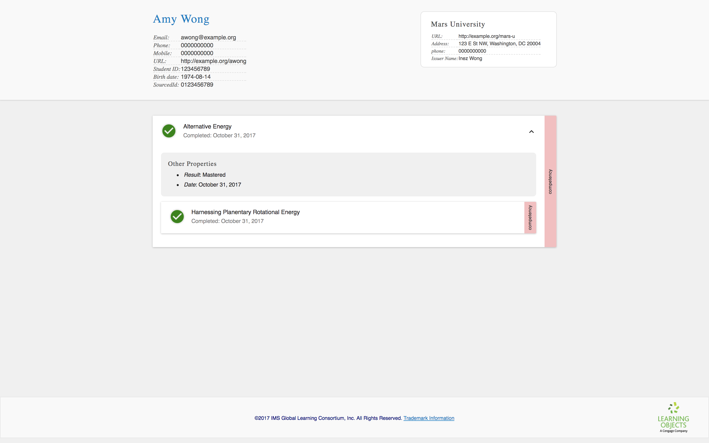

### <a id="associating-competencies"></a> Associating the competencies

Third, let's declare that "Alternative Energy" is the parent of "Harnessing Planetary Rotational Energy":

```
{
  ...
  "transcriptEntities": {
    "id": "urn:uuid:98f56753-973d-4c2d-865a-f567c9896ed7",
    "type": "TranscriptEntitySet",
    "competencies": [
      {
        "id": "urn:uuid:D2986DEB-AF8D-42B9-9E29-E64784B9E12C",
        "type": "Competency",
        "name": "Harnessing Planetary Rotational Energy"
      },{
        "id": "urn:uuid:b2c3235a-49a5-4222-aba9-80c960cb832e",
        "type": "Competency",
        "name": "Alternative Energy",
        "associations": [
          {
            "id": "urn:uuid:7aade551-fbc8-44b5-8b96-036632858117",
            "type": "Association",
            "entityType": "Competency",
            "entityId": "urn:uuid:D2986DEB-AF8D-42B9-9E29-E64784B9E12C",
            "associationType": "isParentOf"
          }
        ]
      }
    ]
  }
}
```

Note that the `Association`'s `entityId` matches the `id` for the "Harnessing Planetary Rotational Energy" competency. Similar to how records reference entities, this is how we relate entities to other entities.

> *Technical aside*: order of transcript entities is not important; you may make forward or backward references.

Save the changes and upload it to the viewer.

<table class="image">
<caption align="bottom">The competencies are now associated via a parent-child association.</caption>
<tr><td></td></tr>
</table>

Alternatively, we could have declared that "Harnessing Planetary Rotational Energy" is the child of "Alternative Energy" using the `"isChildOf"` type. Can you figure out how?

There are a total of ten available association types, though you will probably mostly use `"isParentOf"` or `"isChildOf"`. The standard is very flexible: any transcript entity may have any association with any association type with any other transcript entities. But of course, the provider is responsible for generating transcripts where these associations make sense to the people using the transcripts and the systems interpreting them.

> *Technical aside*: For more discussion on what is sensible, see the section on [Cycles and Paradoxes](https://www.imsglobal.org/sites/default/files/ExtendedTranscript/etv1p0candidatefinal/ET-Bestpractices/etservicev1p0_bestpracticesv1p0.html#cycles-and-paradoxes) in the Extended Transcript Recommended Practices guide.

To learn more about available associations, see the [AssocationType Vocabulary Description](https://www.imsglobal.org/sites/default/files/ExtendedTranscript/etv1p0candidatefinal/ET-InformationModel/ETServiceGroup_InfoModel.html#Enumerated_AssociationType) section within the Extended Transcript Information Model documentation.
